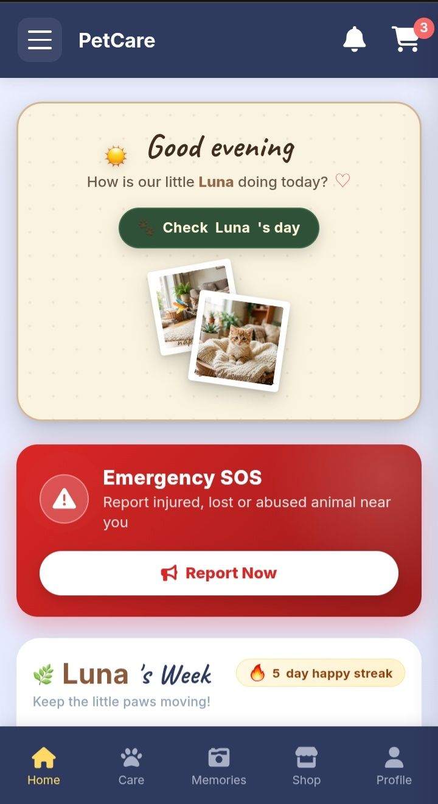
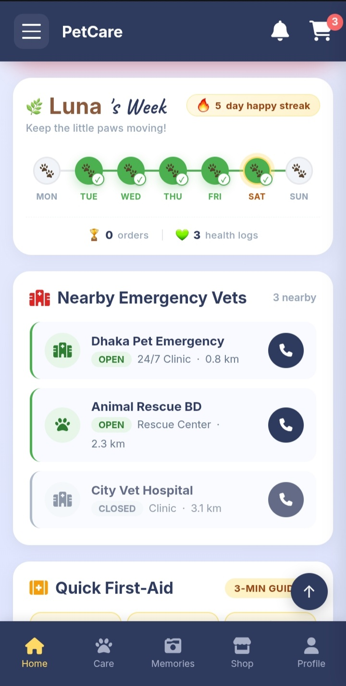
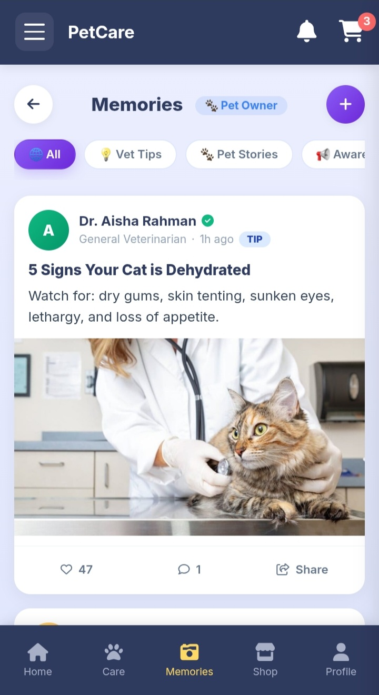
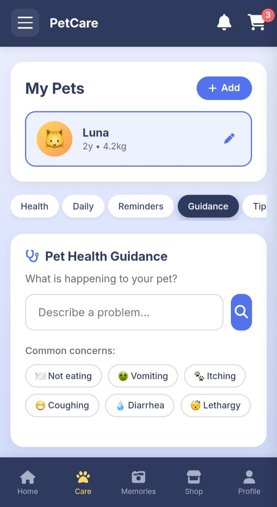

# 🐾 PetCare — A Pet Care Companion

A mobile-first pet care web app built for **AnimalHack 2026**. PetCare helps pet owners track their pet's health, manage daily care, connect with veterinarians, and share experiences in a community feed — all in one place.

**Live Demo:** [https://luzaynarahman-dot.github.io/PetCare/](https://luzaynarahman-dot.github.io/PetCare/)

---

## 📸 App Preview

| 🏠 Home & Emergency SOS | 🏥 Nearby Emergency Vets | 📸 Vet Community Feed | 🐾 Pet Health Guidance |
| :---: | :---: | :---: | :---: |
|  |  |  |  |

---

## 🎯 The Problem

Pet owners often juggle multiple apps: one for health records, one for shopping, one for vet advice. When emergencies happen, they don't know where to turn. And there's no dedicated space for pet owners and veterinarians to share knowledge and build community.

PetCare solves this — one app, everything in one place.

---

## ✨ What PetCare Does

### 🏠 Home Dashboard
A personalized greeting with your pet's photo, a weekly paw-print progress tracker, quick stats, and a prominent Emergency SOS card.

### 🚨 Emergency & Rescue
- **Emergency SOS** — Report an injured, lost, or abused animal with live GPS location detection
- **Nearby Emergency Vets** — Find 24/7 clinics and rescue centers with distance and open/closed status
- **6 First-Aid Guides** — Step-by-step emergency instructions for Choking, Poisoning, Bleeding, CPR, Heat Stroke, and Fracture
- **Urgent Foster** — Pets in need of immediate foster care or adoption

### 🐾 Pet Care
- Multi-pet health tracking with weight progress charts
- Vaccination records with completion status
- Medication reminders with next-dose tracking
- Daily care checklist (feeding, water, exercise, grooming)
- **Symptom Guidance** — Rule-based diagnostic tool for 6 common health concerns
- Care tips library covering nutrition, hygiene, exercise, grooming, safety, and behavior

### 📸 Memories (Social Feed)
A community space where **pet owners and verified veterinarians** share tips, stories, awareness posts, and questions. Vets get a verified badge, posts support likes and comments, and content can be filtered by category.

### 🛒 Pet Shop
Browse adoption listings, pet food, and accessories. Live search, sort/filter by price/rating/popularity, wishlist, cart, checkout, and 4-step order tracking.

### 👤 Profile & Roles
Users can switch between **Pet Owner** and **Veterinarian** modes. Vets complete a license verification form to get a verified badge in the community feed.

### 🌙 Experience
Full dark mode support, offline-first storage, in-app notifications, and playful animations throughout.

---

## 🧠 What I'm Proud Of

The **Memories community feed**. In most pet apps, there's no space for the two most important groups — pet owners and veterinarians — to interact. In PetCare, verified vets can post tips and answer questions, and pet owners can share real experiences. It turns a utility app into a community.

---

## 🛠️ Tech Stack

- **Frontend:** HTML5, CSS3, Vanilla JavaScript (ES6+)
- **Charts:** Chart.js
- **Icons:** Font Awesome 6
- **Fonts:** Inter, Caveat (Google Fonts)
- **Carousel:** Swiper.js
- **Effects:** Canvas Confetti
- **Storage:** localStorage (offline-first)
- **Backend:** Ready-to-connect API service layer with mock mode

*No frameworks. No build step. Pure vanilla JavaScript.*

---

## 📁 Project Structure

```text
PetCare/
├── index.html              # SPA shell
├── style.css               # Full stylesheet
├── script.js               # Application logic
├── api.js                  # API service layer (backend-ready)
├── drawer.js               # Side menu system
├── screenshots/            # App preview screenshots
└── pet-care-images/        # All images and assets
